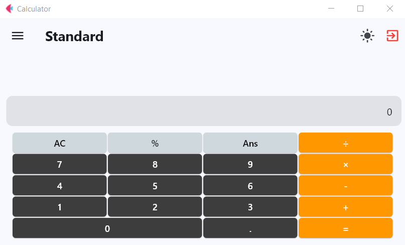

# Advanced Calculator

A multi-functional desktop calculator application built with **Python** and **Flet**. This project goes beyond standard arithmetic, offering specialized tools for scientific calculations, date operations, and number system conversions in a modern, responsive user interface.

## 🚀 Features

* **Standard Calculator**: Perform basic arithmetic operations (`+`, `-`, `×`, `÷`), calculate percentages, and retrieve previous answers (`Ans`).
* **Scientific Calculator**: Access advanced mathematical functions for complex calculations.
* **Date Calculation**: Calculate the difference between dates or manipulate date values.
* **Number Systems Converter**:
* Convert between **Binary**, **Decimal**, **Octal**, and **Hexadecimal**.
* **Text-to-Binary/Hex/etc.** conversion support (ASCII/UTF-8 decoding).


* **Modern UI**:
* **Navigation Drawer**: Easily switch between different calculator modes.
* **Dark/Light Mode**: Toggle between themes for visual comfort.
* Responsive design that adjusts to window resizing.


## 🛠️ specific Version Support

This project has been updated and tested to support **Flet version 0.28.3**.

## 📂 Project Structure

* `Main.py`: The entry point of the application, handling navigation and window settings.
* `Calculator.py`: Logic and UI for the Standard Calculator.
* `Calculator_2.py`: Logic for Date Calculations.
* `Calculator_3.py`: Logic for the Scientific Calculator.
* `Calculator_4.py`: Interface for the Number Systems Converter.
* `Number_systems.py`: Core logic for converting base numbers and text.
* `mode.py`: Manages theme switching (Dark/Light mode).

## 📦 Installation

1. **Clone the repository:**
```bash
git clone https://github.com/youssef3082004/advanced-calcultor.git
cd advanced-calcultor

```


2. **Install dependencies:**
It is recommended to use the Flet version mentioned above.
```bash
pip install flet==0.28.3 python-dateutil

```


## ▶️ Usage

To start the application, run the `Main.py` file:

```bash
python Main.py

```

# 💻 Application Screen
[](https://drive.google.com/file/d/10rDnCweB19cRZqb9MRT-FQ76719EFq9J/view?usp=sharing)

> ⚠ Note: You can click image to See **`Project Demo`**


## 📜 Requirements

* Python 3.13.x
* `flet` (Supported: **0.28.3**)
* `python-dateutil`

---

*Note: Icons are referenced from a local directory in the code. You may need to update the icon path in `Main.py` if you wish to display a custom window icon.*